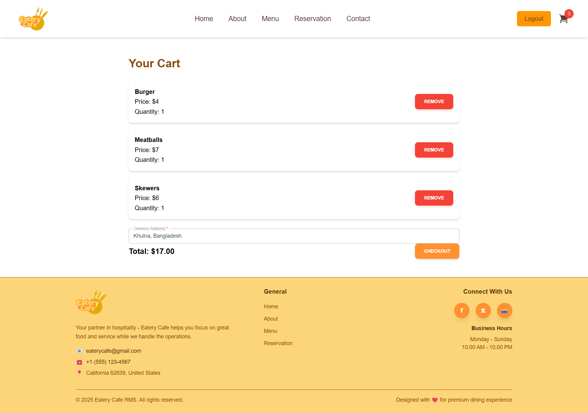

# Eatery Cafe - Restaurant Management System

Eatery Cafe is a full-stack Restaurant Management System (RMS) built with the MERN stack (MongoDB, Express.js, React.js, Node.js). It features a user-facing frontend for browsing menus, making reservations, and placing orders, along with an admin dashboard for managing menu items, reservations, orders and users.

# Screenshots

<table>
  <tr>
    <td></td>
  </tr>
  <tr>
    <td></td>
    <td></td>
    <td></td>
  </tr>
  <tr>
    <td></td>
    <td></td>
    <td></td>
  </tr>
  <tr>
    <td></td>
    <td></td>
    <td></td>
  </tr>
  <tr>
    <td></td>
    <td></td>
  </tr>
</table>

## Features

### ✅ Frontend (React)
- Landing page with sections: Navigation bar, About, Menu, Offer, Reviews, Reservation, Contact, Footer
- Pages: About, Menu, Reservation.
- Authentication (User/Admin)
- Forget/Reset Password.
- User dashboard for reservations and orders.
- Shopping cart and Stripe payment integration

### ✅ Backend (Node.js + Express)
- RESTful API with JWT authentication
- Cloudinary integration for image uploads
- MongoDB for data storage
- Routes & controllers for:
  - User Authentication
  - Menu Management
  - Orders
  - Reservations
  - Notification

### ✅ Admin Dashboard
- Login for Admin users
- View all users (admins cannot be deleted)
- Add/delete food items (reflected on frontend)
- Changes Status, View/delete reservation requests
- View/delete orders

---

## 🚀 Getting Started

### 1. Clone the repository
```bash
git clone https://github.com/kushalkumarghosh/eatery-cafe-rms
cd eatery-cafe-rms
```

### 2. Setup Backend
```bash
cd backend
npm install
```

Create a `.env` file in the `backend/` directory:
```env
PORT=5000
MONGO_URI=your_mongodb_connection_string
JWT_SECRET=your_jwt_secret
CLOUDINARY_CLOUD_NAME=your_cloudinary_name
CLOUDINARY_API_KEY=your_api_key
CLOUDINARY_API_SECRET=your_api_secret
JWT_SECRET=your_jwt_secret
STRIPE_SECRET_KEY=your_stripe_secret_key
SMTP_HOST=your_smtp_host_email
SMTP_PORT=your_smtp_port
SMTP_USER=your_smtp_user_email
SMTP_PASS=your_smtp_user_pass
```

Start the backend server:
```bash
nodemon index.js
```

### 3. Setup Frontend 
```bash
cd frontend
npm install
npm run dev
```

---

## 🔐 Authentication

- JWT-based auth for both users and admins.
- Admins are redirected to the admin dashboard.
- Normal users are redirected to the home page.

---

## 💳 Stripe Integration

- Users must register/login to add items to the cart and checkout.
- Stripe is used to securely process payments.

---

## 📦 Dependencies

### Backend:
- express
- mongoose
- jsonwebtoken
- cloudinary
- multer
- stripe
- bcrypt 
- cors
- dotenv
- nodemon
- socket.io
- nodemailer
- express-rate-limit

### Frontend:
- react
- react-router-dom
- axios 
- react-hook-form
- react-hot-toast
- react-slick
- @stripe/stripe-js
- @material-tailwind/react
- react-hot-toast
- @heroicons/react
- vite
- tailwindcss
- eslint
- axios-socket.io-client


---

## 📄 License

This project is licensed under the MIT License. See the LICENSE file for details.